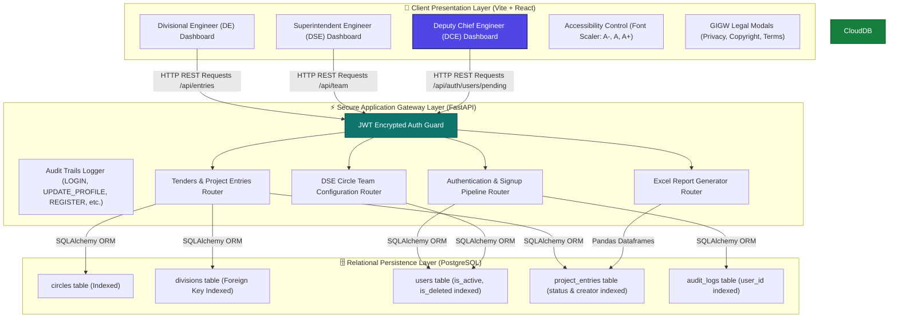
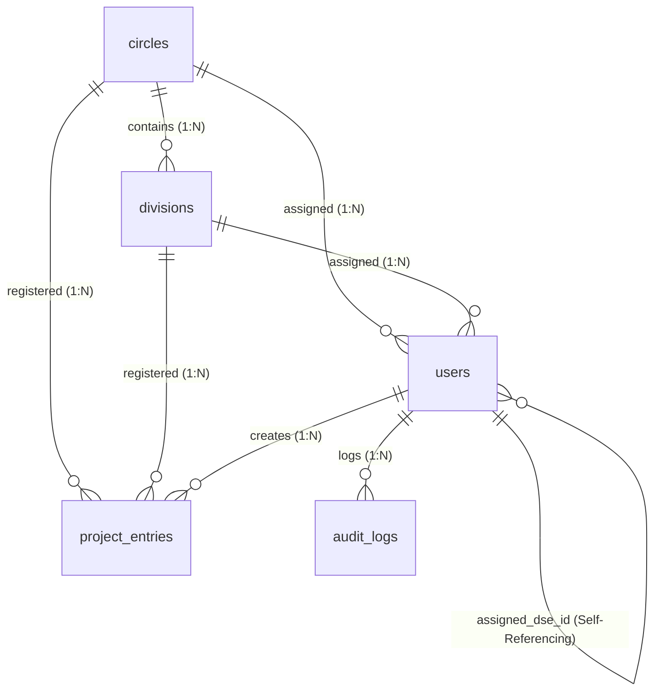

# 🏛️ National Highways Research Station (NHRS) Portal

### தேசிய நெடுஞ்சாலைகள் ஆராய்ச்சி நிலையம், சென்னை
**Highway Department, Government of Tamil Nadu & National Highways Authority of India (NHAI) Joint Oversight Portal**

A GIGW-compliant, highly secure, role-based database portal designed for managing, auditing, and exporting highway tender sanction records, contract progress, and circle team hierarchies. Built using a modern **FastAPI (Python) + React (Vite & Tailwind) + PostgreSQL** stack.

---

## 🛰️ 1. Complete System Architecture & Data Flow

This 3-tier enterprise system secures transactions and restricts data visibility using role-based query isolation. Below is the comprehensive data pipeline:



---

## 🗄️ 2. Relational Database Schema & Performance Indexing

The schema enforces strict referential integrity. Primary and foreign key relationships are systematically indexed to guarantee $O(\log N)$ fast lookups during deep table scans or pagination filters.



### Table Details & Structural Schema

#### 1. `circles`
Represents official administrative circles (Chennai, Madurai, Coimbatore, etc.).
* `id` (Integer): Primary Key (Auto-Increment)
* `name` (String(100)): Unique, Non-Nullable, **Indexed**
* `created_at` (DateTime): Defaults to UTC now

#### 2. `divisions`
Represents physical division offices under each Circle.
* `id` (Integer): Primary Key (Auto-Increment)
* `name` (String(100)): Non-Nullable, **Indexed**
* `circle_id` (Integer): Foreign Key $\rightarrow$ `circles.id` (On Delete: Cascade), Non-Nullable
* `created_at` (DateTime)

#### 3. `users`
Represents portal accounts and designations.
* `id` (Integer): Primary Key (Auto-Increment)
* `name` (String(100)): Non-Nullable (User's full name & initial)
* `email` (String(150)): Unique, Non-Nullable, **Indexed**
* `password_hash` (String(255)): Non-Nullable (Securely hashed using bcrypt)
* `role` (Enum): `DCE` (Super Admin), `DSE` (Circle Manager), `DE` (Divisional submitter)
* `circle_id` (Integer): Foreign Key $\rightarrow$ `circles.id` (On Delete: Set Null), Nullable
* `division_id` (Integer): Foreign Key $\rightarrow$ `divisions.id` (On Delete: Set Null), Nullable
* `assigned_dse_id` (Integer): Self-referencing Foreign Key $\rightarrow$ `users.id` (DE mapped to DSE)
* `is_active` (Boolean): Default `False` (Pending Super Admin approval)
* `is_deleted` (Boolean): Default `False` (Soft deletion check)
* `created_at` (DateTime), `updated_at` (DateTime)

#### 4. `project_entries`
Stores the **21 core columns** tracking high-fidelity highway tenders and work order contracts.
* `id` (Integer): Primary Key (Auto-Increment)
* `created_by_id` (Integer): Foreign Key $\rightarrow$ `users.id` (Creator, **Indexed**)
* `circle_id` (Integer): Foreign Key $\rightarrow$ `circles.id` (**Indexed**)
* `division_id` (Integer): Foreign Key $\rightarrow$ `divisions.id` (**Indexed**)
* **Administrative Details**:
  * `scheme` (String(100)): Scheme name (e.g. CRIDP, Special Roads, **Indexed**)
  * `year` (String(20)): Financial year (e.g. 2025-26, **Indexed**)
  * `go_details` (Text)
  * `technical_sanction` (Text)
  * `admin_sanction_value` (Float): Administrative Sanction Value (in Lakhs)
  * `tech_sanction_value` (Float): Technical Sanction Value (in Lakhs)
  * `name_of_work` (Text): Detailed name of highway construction
* **Tender & Acceptance**:
  * `tender_notice_no` (String(100)), `tender_notice_date` (Date)
  * `contract_value` (Float): Contract acceptance value (in Lakhs)
  * `bid_submission_date` (Date), `bid_opening_date` (Date)
  * `tender_accepting_authority` (String(100))
  * `tender_approved_on` (Date)
* **Execution & Auditing**:
  * `work_order_issued_on` (Date), `agreement_executed_on` (Date)
  * `present_stage` (Text): Progress stage (Surveying, Earthwork, Completed, etc., **Indexed**)
  * `remarks` (Text): Office files notes
* **Review States**:
  * `status` (String(50)): `"PENDING"`, `"APPROVED"`, `"REJECTED"` (**Indexed**)
  * `rejection_reason` (Text): Mandatory on DSE rejection
  * `is_deleted` (Boolean), `submitted_at` (DateTime), `reviewed_at` (DateTime)

#### 5. `audit_logs`
Permanent ledger capturing system actions.
* `id` (Integer): Primary Key (Auto-Increment)
* `user_id` (Integer): Foreign Key $\rightarrow$ `users.id` (**Indexed**)
* `action` (String(100)): Action types (`LOGIN`, `REGISTER`, `APPROVE_USER`, `UPDATE_PROFILE`, etc.)
* `details` (Text): Human-readable descriptions of changes
* `timestamp` (DateTime)

---

## 🔒 3. Role-Based Access Control (RBAC) & Features Matrix

The portal implements strict row-level isolation and permission limits based on roles:

| Feature / Action | 👷 Divisional Engineer (DE) | 👮 Superintendent Engineer (DSE) | 🏛️ Deputy Chief Engineer (DCE) |
| :--- | :---: | :---: | :---: |
| **Registration Eligibility** | Public Registration | Public Registration | Backend Locked (DB Admin Only) |
| **Initial Login State** | **Blocked** (Pending approval) | **Blocked** (Pending approval) | Active |
| **Active Target View Scope** | Own Division only | Own Circle only | **Global Master Scope** |
| **Submit Tenders Form** | Yes (21 Fields Form) | No | No |
| **Delete / Edit Entries** | Yes (If still PENDING) | No | Yes (Global Soft Delete) |
| **Review Work Status** | No | **Yes** (Approve / Reject circle DEs) | No (View Mode Only) |
| **Configure Teams** | No | **Yes** (Manage active Circle DEs) | No |
| **Global Filters Console** | No | No | **Yes** (Search Scheme, Circle, Division, Stage) |
| **Audit Log Trail** | No | No | **Yes** (Read-Only Live Trail) |
| **Excel Report Export** | No | No | **Yes** (Export filtered tenders) |
| **Manage Signup Queue** | No | No | **Yes** (Approve/Reject pending signups) |
| **Change Profile** | Name & Password | Name & Password | Name & Password |

---

## ♿ 4. GIGW & Accessibility (a11y) Features

The application satisfies strict **GIGW (Guidelines for Indian Government Websites)** checkboxes:
1. **Accessibility Resizing Bar**: Floating header provides immediate font size controls (`A-`, `A`, `A+`) modifying `document.documentElement` scale, automatically recalculating all tailwind `rem` units globally. Preset cached inside browser `localStorage`.
2. **State & National Branding**: Integrates colorful high-fidelity SVG crests of the **Government of Tamil Nadu** and **NHAI secondary tags** inside standardized white containers.
3. **Bilingual Administrative Titles**: Integrated Tamil and English titles across dashboards (e.g. `தேசிய நெடுஞ்சாலைகள் ஆராய்ச்சி நிலையம்`).
4. **Interactive website Policies**: Footer links open immediate backdrop-blurred policy dialog modals for **Privacy Policy, Hyperlinking Policy, Copyright Policy, and Terms & Conditions** without reloading form status or disrupting user progress.
5. **Robust Offline Typography**: Formatted with `Inter` as the primary font and supported by a robust native OS-level fallback stack (`-apple-system`, `BlinkMacSystemFont`, etc.) ensuring fast, zero-delay rendering in offline state offices.

---

## 🚀 5. Local Setup & Installation Guide

Ensure you have **Python 3.10+**, **Node.js 18+**, and **PostgreSQL** installed locally.

### 🔌 A. Backend Installation (FastAPI)

1. Navigate to the backend directory:
   ```bash
   cd backend
   ```
2. Create and activate a virtual environment:
   ```bash
   python3 -m venv venv
   source venv/bin/activate  # On Windows: venv\Scripts\activate
   ```
3. Install standard requirements:
   ```bash
   pip install -r requirements.txt
   ```
4. Create your `.env` configuration file inside `backend/`:
   ```env
   DATABASE_URL=postgresql://<user>:<password>@localhost:5432/gov_highway_tenders
   SECRET_KEY=NHRS_SECRET_KEY_FOR_JWT_SECURE_TOKEN_5849302
   ALGORITHM=HS256
   ACCESS_TOKEN_EXPIRE_MINUTES=480
   ```
5. Pre-seed the database metadata (Circles, Divisions, and Demo Profiles):
   ```bash
   python3 seed.py
   ```
6. Run the uvicorn development server:
   ```bash
   uvicorn main:app --reload --port 8000
   ```

### 🎨 B. Frontend Installation (React Vite)

1. Navigate to the frontend directory:
   ```bash
   cd ../frontend
   ```
2. Install dependencies:
   ```bash
   npm install
   ```
3. Run the development server (runs proxying `/api` requests to backend on port 8000 automatically):
   ```bash
   npm run dev
   ```
4. Build the production build:
   ```bash
   npm run build
   ```

---

## 🔬 6. Verification & Automated Test Suites

The backend features rigorous permission checks and pipeline integration tests inside `test_endpoints.py`.

To run the automated tests:
```bash
cd backend
python3 -m unittest test_endpoints.py
```

#### Test Coverage:
1. **RBAC Workflow Test**: Validates Divisional Engineer (DE) entry submission $\rightarrow$ data isolation guards preventing other DEs from accessing private circles data $\rightarrow$ Circle DSE manager review approvals $\rightarrow$ DCE Super Admin central auditing $\rightarrow$ administrative soft delete.
2. **Registration Queue Pipeline Test**: Validates inactive registration default $\rightarrow$ login blockade with custom pending approval message $\rightarrow$ DCE pending registrations queue fetching $\rightarrow$ DCE approval action $\rightarrow$ successful subsequent login $\rightarrow$ automatic DSE manager assignment.
3. **User Profile Update Test**: Validates name change $\rightarrow$ secure password modification $\rightarrow$ password strength enforcement $\rightarrow$ old password invalidation $\rightarrow$ new password successful authentication $\rightarrow$ database state recovery $\rightarrow$ `UPDATE_PROFILE` audit trail logs writing.
